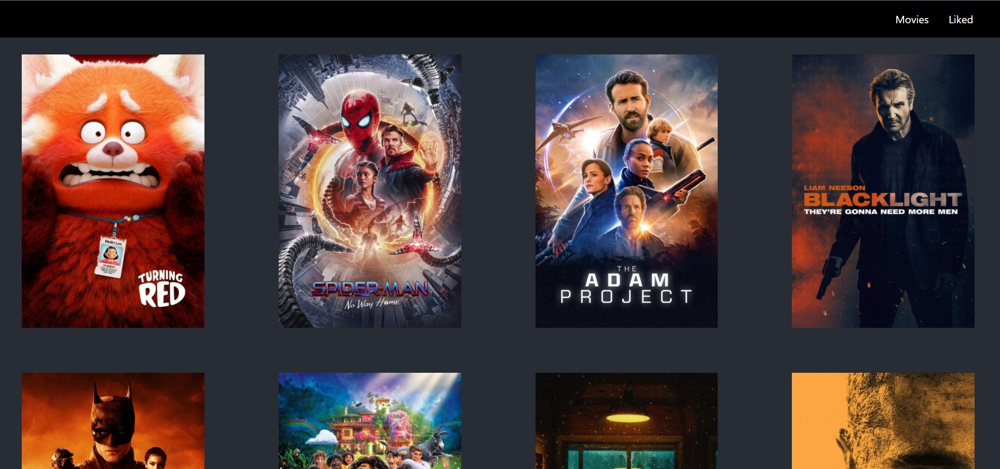
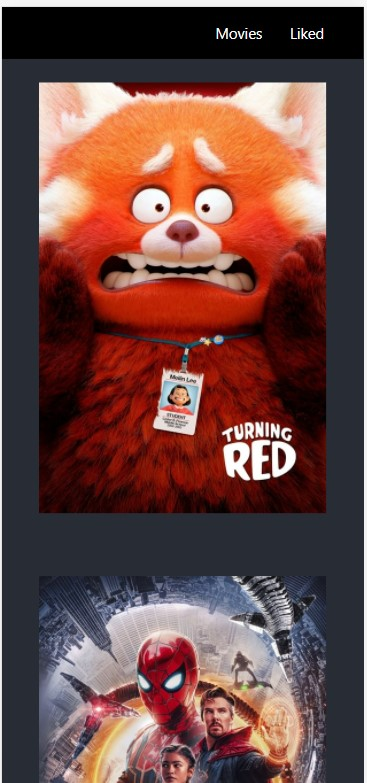

# Movie Poster

## Welcome! 👋

Thanks for checking out this coding challenge. This is a fully responsive poster App that allows you to like and save liked movie poster to a /liked route. The like button shows up on image hover. Once liked the image move to the /liked route and the button on the image chages to dislike. When a movie is disliked, it is subsequently removed from the /liked route.

# Install dependencies for server
npm install

# Install dependencies for client
npm run client-install

# Run the Express server only
npm run server

# Run the React client only
npm run client

## Server runs on http://localhost:5000 and client on http://localhost:3000

## App Info

### Author

Rofiat Olusanya 

### Version

1.0.0

### This is a full stack react App

